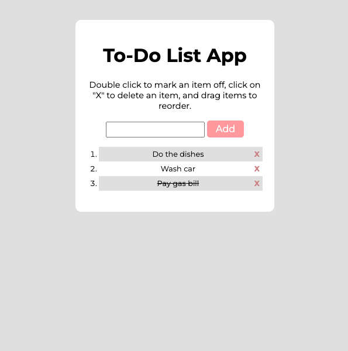

# To-do List

## Project Description
This project was part of the Career Foundry Full Stack Web Development course. It's a small web application with HTML, CSS, and JavaScript meant to make me familiar with jQuery concepts.

This is a Mini To Do List App. The user can add and remove items, as well as strike through items from the list. Also, the items on the list can be ordered.

This app was built as part of the Career Foundry Full Stack Web Development Crouse. The purpose of the app was to get familiarized with the concepts of jQuery.

## Key features
* User can add a new task
* User can remove a task
* User can strike task as done
* User can reorder the tasks

## Technologies Used
Javascript ES6, jQuery

## Links
* **Repository:** https://github.com/mareeanamaro/todolist-app
* **Live link:** https://mareeanamaro.github.io/todolist-app/ 